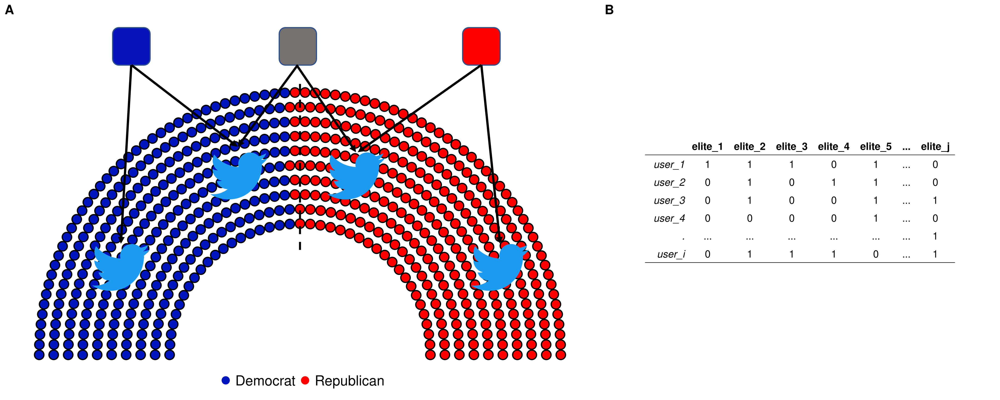
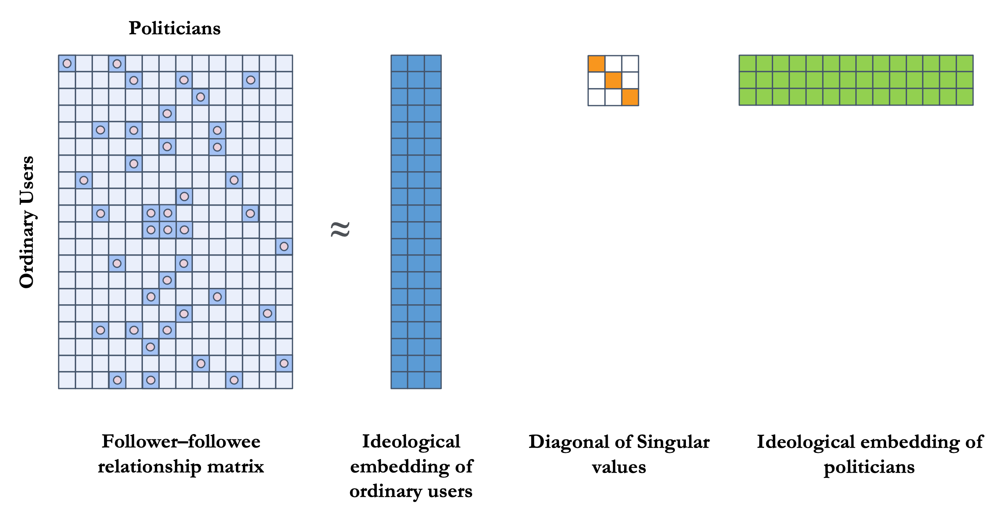
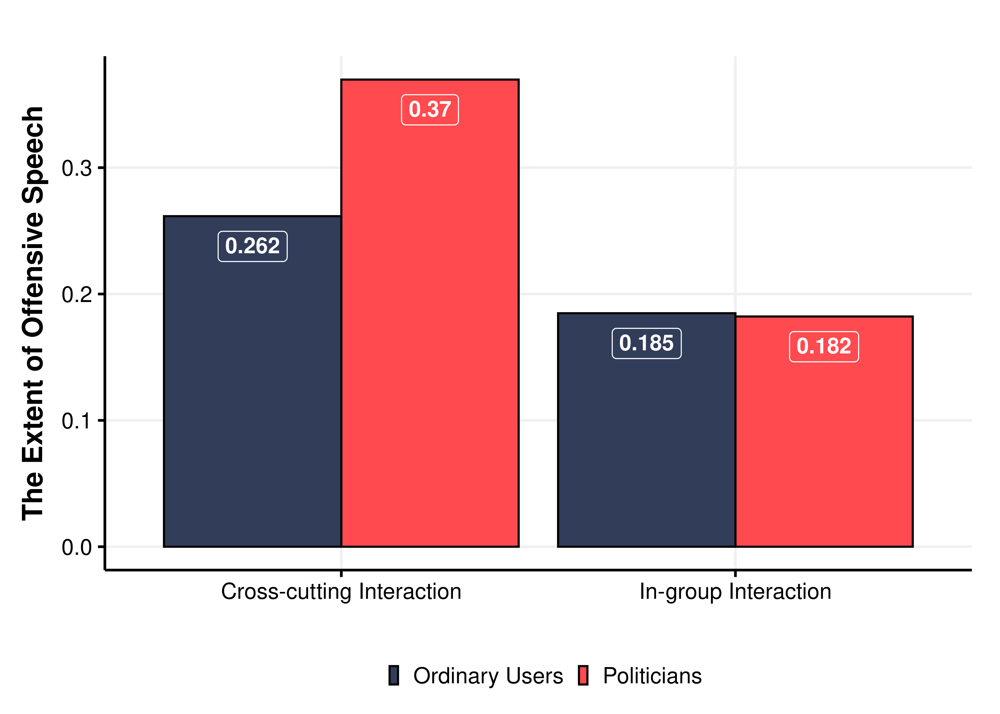
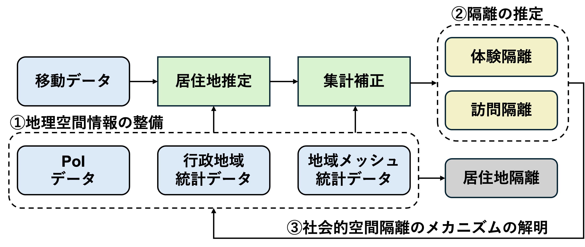
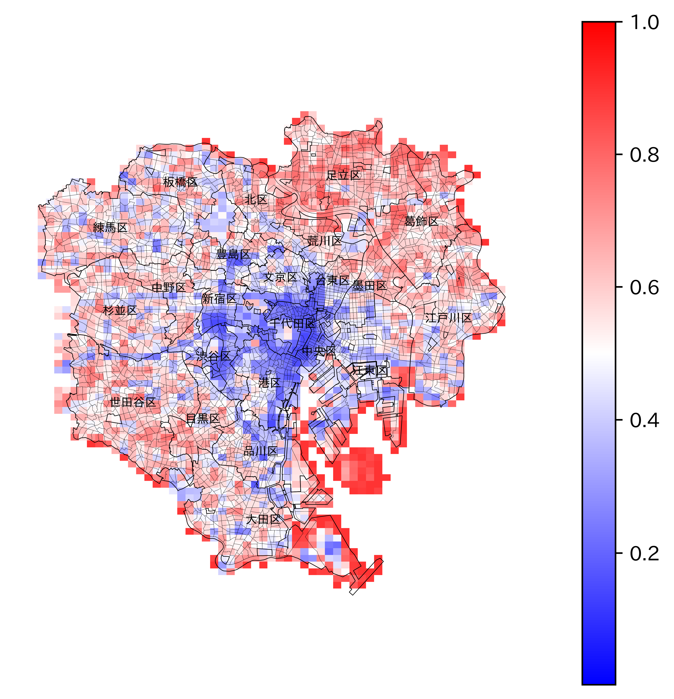
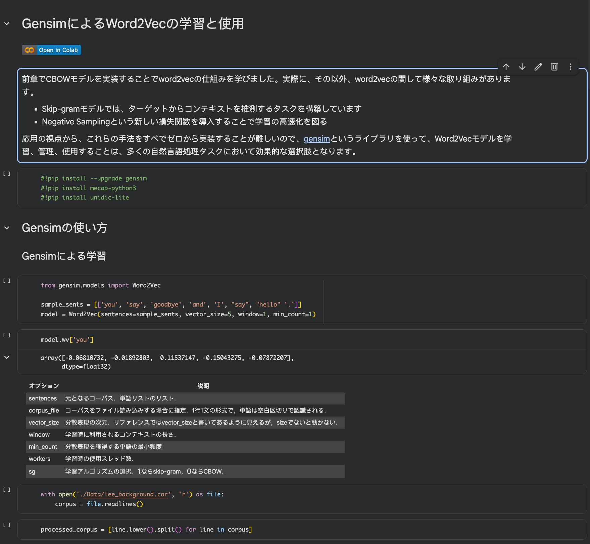
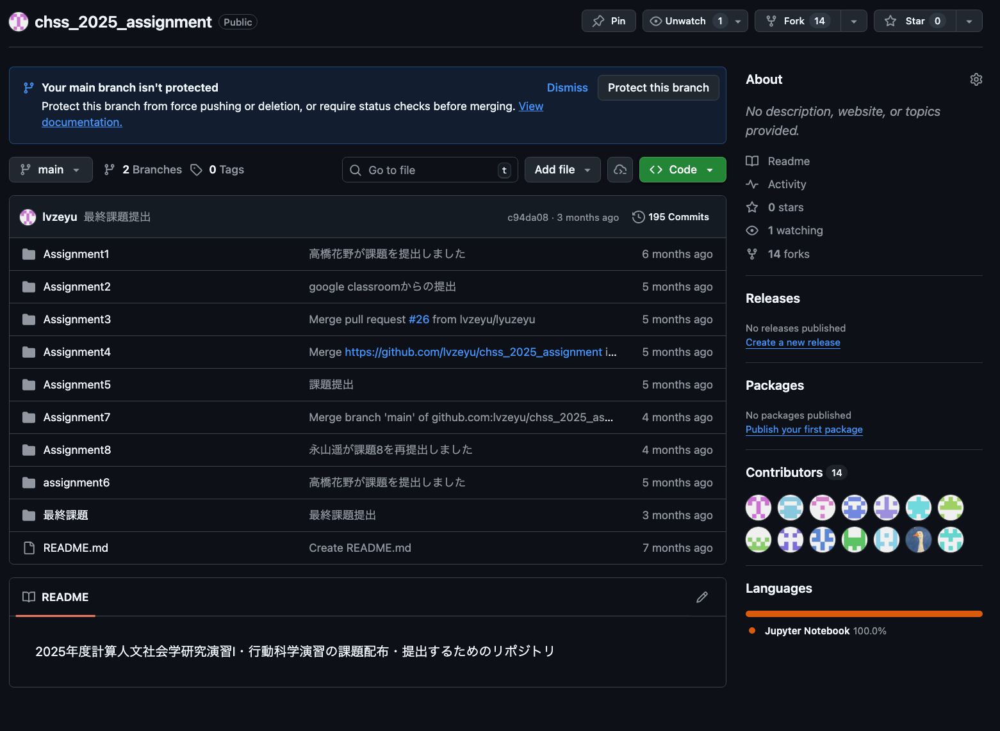
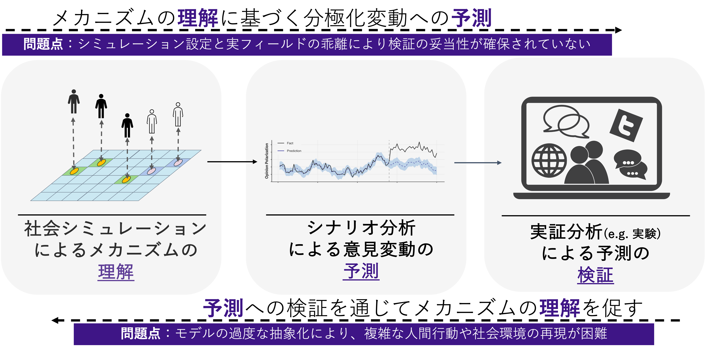
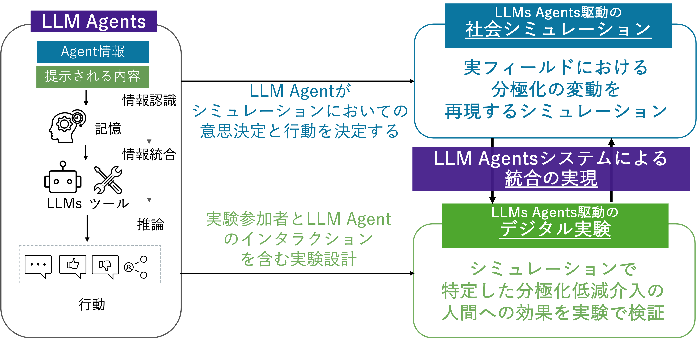
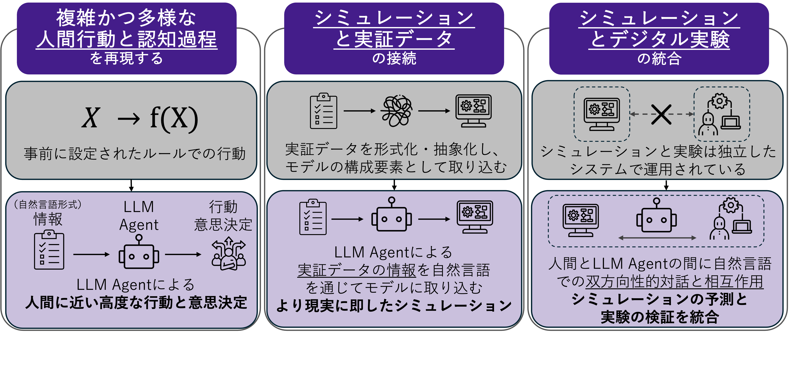

---
# try also 'default' to start simple
theme: neversink
# random image from a curated Unsplash collection by Anthony
# like them? see https://unsplash.com/collections/94734566/slidev
#background: https://cover.sli.dev
# some information about your slides (markdown enabled)
title: テニュア審査発表
drawings:
  persist: false
# slide transition: https://sli.dev/guide/animations.html#slide-transitions
transition: slide-left
# enable MDC Syntax: https://sli.dev/features/mdc
mdc: true
# duration of the presentation
duration: 20min
color: navy-light
layout: intro
colorSchema: light
---

# 総合人間学専攻社会人間学講座

## テニュア審査発表

### 呂 沢宇 / Zeyu Lyu <a href="https://researchmap.jp/lyuzeyu" class="ns-c-iconlink"><mdi-open-in-new /></a>  

2025年11月25日

  <a href="https://tohoku.elsevierpure.com/en/persons/zeyu-lyu/" target="_blank" class="slidev-icon-btn">
  <svg xmlns="http://www.w3.org/2000/svg" width="1.3em" height="1.3em" viewBox="0 0 24 24" fill="currentColor">
    <path d="m24 19.059l-.14-1.777c-1.426.772-2.945 1.076-4.465 1.076c-3.319 0-5.96-2.782-5.96-6.475c0-3.903 2.595-6.31 5.633-6.31c1.917 0 3.39.303 4.792 1.075L24 4.895c-1.286-.608-2.337-.889-4.698-.889c-4.534 0-7.97 3.53-7.97 8.017c0 5.12 4.09 7.924 7.9 7.924c1.916 0 3.506-.257 4.768-.888m-14.954-3.46c0-2.22-1.964-3.225-3.857-4.347C3.716 10.364 2.15 9.756 2.15 8.12c0-1.215.889-2.548 2.642-2.548c1.519 0 2.57.234 3.903 1.029l.117-1.847c-1.239-.514-2.127-.748-4.137-.748C1.8 4.006.047 5.876.047 8.26s2.103 3.413 4.02 4.581c1.426.865 2.922 1.45 2.922 2.992c0 1.496-1.333 2.571-2.922 2.571c-1.566 0-2.594-.35-3.786-1.075L0 19.176c1.215.56 2.454.818 4.16.818c2.385 0 4.885-1.473 4.885-4.395z"/>
  </svg>
</a>
  <a href="https://scholar.google.com/citations?user=W1k3wDIAAAAJ&hl=ja" target="_blank" class="slidev-icon-btn">
  <svg xmlns="http://www.w3.org/2000/svg" width="1.3em" height="1.3em" viewBox="0 0 512 512" fill="currentColor">
    <path d="M390.9 298.5s0 .1.1.1c9.2 19.4 14.4 41.1 14.4 64C405.3 445.1 338.5 512 256 512s-149.3-66.9-149.3-149.3c0-22.9 5.2-44.6 14.4-64c1.7-3.6 3.6-7.2 5.6-10.7q6.6-11.4 15-21.3c27.4-32.6 68.5-53.3 114.4-53.3c33.6 0 64.6 11.1 89.6 29.9c9.1 6.9 17.4 14.7 24.8 23.5c5.6 6.6 10.6 13.8 15 21.3c2 3.4 3.8 7 5.5 10.5zm26.4-18.8c-30.1-58.4-91-98.4-161.3-98.4s-131.2 40-161.3 98.4L0 202.7L256 0l256 202.7l-94.7 77.1z"/>
  </svg>
  </a>

---
layout: top-title
color: navy-light
---

:: title ::

# 発表の流れ

:: content ::

- **東北大学着任後の業績**
    - 研究実績：主要な研究内容・研究活動 / 論文・学会発表の状況
    - 教育実績：授業設計と学生指導における工夫

- **今後の研究に対する抱負**
    - 今後の研究計画：競争的資金獲得を見据えた研究の発展と高度化
    - 研究業績に関する目標: 着実に国際的な論文成果へつなげる研究を推進

- **今後の教育に対する抱負**
    - 研究室の運営: 研究グループとして活動するための体制・環境の整備

---
layout: section
---

# `東北大学着任後の業績` 

東北大学着任後の研究実績と教育実績について紹介する

---
layout: side-title
side: l
color: violet-light
titlewidth: is-3
align: lt-lt

---

:: title ::

# デジタル空間における意見形成メカニズムの解明

- ビッグデータ、自然言語処理、ネットワーク分析などの計算的手法を用いて、デジタル空間における意見のダイナミクスやインタラクションの実態を把握し、その背後にあるメカニズムを体系的に解明

  <mdi-arrow-right />

:: content ::

#### ソーシャルメディアにおける、異なるイデオロギーを持つ人々が政治的アイデンティティによる意見対立の激化 [(Lyu, 2023)](https://journals.sagepub.com/doi/10.1177/14614448231180654)

  <h4 class="bg-violet-500 text-white px-6 py-2 m-0">フォローネットワークによるイデオロギーの推定</h4>
  

    

      
    

    

      
    

  

  

    <h4 class="bg-violet-500 text-white px-6 py-2 m-0">推定結果の検証</h4>
    

      
    

  

  

    <h4 class="bg-violet-500 text-white px-6 py-2 m-0">意見対立の実態</h4>
    

      
    

  

関連する論文: <a href="https://dl.acm.org/doi/10.1145/3358695.3360922" target="_blank" style="color: inherit; text-decoration: none;">Lyu (2019)</a>, <a href="https://doi.org/10.11218/ojjams.35.170" target="_blank" style="color: inherit; text-decoration: none;">Lyu (2020)</a>, <a href="https://doi.org/10.1016/j.heliyon.2022.e10419" target="_blank" style="color: inherit; text-decoration: none;">Lyu & Takikawa (2022)</a>, <a href="https://osf.io/preprints/socarxiv/9hvgf_v1" target="_blank" style="color: inherit; text-decoration: none;">Lyu,Takikawa & Shimokubo (2025)</a>.

<!--
まず、現在取り組んでいる主要な研究内容についてご紹介いたします。

ビッグデータ、自然言語処理、ネットワーク分析などの計算的手法を用いて、デジタル空間における意見のダイナミクスやインタラクションの実態を把握し、その背後にあるメカニズムを解明する研究に長年取り組んでまいりました。

[click] 具体的な研究例として、ソーシャルメディアにおいて、異なるイデオロギーを持つ人々が政治的アイデンティティによって意見対立を激化させる現象を説明する論文を発表しております。

[click] この研究では、複数の計算的手法を組み合わせて分析を行いました。まず、人々が自分のイデオロギーに近い政治家をフォローする傾向があるという仮説を立て、ユーザーと政治家のフォローネットワークを構築しました。この仮説に基づき、フォロー関係からイデオロギーが推定できると考え、ネットワークに次元削減を適用することで、ユーザーの潜在的なイデオロギーを推定しました。

[click] 実際に、こうした推定結果を、政治家に対するアンケート調査や選挙結果から得られたイデオロギーと比較することで、本手法の有用性を確認することができました。

さらに、この手法により数百万規模のユーザーのイデオロギーを推定し、それに加えてユーザーの投稿内容も取得。自然言語処理を用いて、発言の意見態度を分析しました。そして、異なるイデオロギーを持つ人々がどのようにインタラクションしているのかを明らかにし、それが政治的アイデンティティとどのように関係しているかについても議論を行いました。

このような、計算的手法でデジタル空間における意見形成を分析する論文はいくつ発表しました。

-->

---
layout: side-title
side: l
color: violet-light
titlewidth: is-3
align: lt-lt

---

:: title ::

# 移動データによる社会的空間隔離の解明

- 社会的空間隔離とは、異なる社会集団が地理的に分離される現象を指す

- 移動ビッグデータと地理空間情報の統合を通して社会的空間隔離の実態を明らかにし、それに基づいて社会的空間隔離の変化メカニズムについて、複数の都市と時点の比較分析を通じて理解する

  <mdi-arrow-right />

:: content ::

  <h4 class="bg-violet-500 text-white px-6 py-2 m-0">
    移動データと地理空間情報による社会的空間隔離の推定
  </h4>
  

    

      
    

    

      <ul class="space-y-0.5">
        <li>2022年から研究協力者として参加しているJSTさきがけプロジェクト(代表:瀧川裕貴)を通じて、大規模移動データと地理空間情報データを管理環境と解析手法を確立した</li>
        <li>2025年採択の<a href="https://kaken.nii.ac.jp/ja/grant/KAKENHI-PROJECT-25K16783/" target="_blank" style="color: inherit; text-decoration: none;">若手研究</a>により、関連研究を推進中</li>
      </ul>
    

  

  

    <h4 class="bg-violet-500 text-white px-6 py-2 m-0">社会的空間隔離の実態</h4>
    

      
    

  

  

    <h4 class="bg-violet-500 text-white px-6 py-2 m-0">社会的空間隔離の推移</h4>
    

      
    

  

関連する論文: <a href="https://medinform.jmir.org/2022/3/e31557" target="_blank" style="color: inherit; text-decoration: none;">Lyu & Takikawa (2022)</a>

<!--
そして、異なる社会集団が地理的に分離される「社会的空間隔離」にも関心を持っています。
異なる社会経済的属性を持つ人々が空間的に分離されることは、階層間対立の要因となるだけでなく、集合的効力やレジリエンスといった、社会全体の価値の実現を妨げる可能性があると考えています。

[click] 本研究では、移動ビッグデータと地理空間情報を統合し、分析を進めています。移動ビッグデータを用いることで、「誰が」「いつ」「どこにいるのか」といった人々の移動パターンを把握することが可能になります。
さらに、地理空間情報からは、空間上の特定エリアに関する人口構成、施設の種類など、多様な社会的特徴に関する情報を得ることができます。

[click] こうした複数のデータを組み合わせることで、社会的空間隔離の実態とその推移を把握し、複数都市・複数時点での比較分析を通じて、その影響要因や変化のメカニズムを明らかにすることが期待されます。

学生時代からすでに本テーマに関連するプロジェクトに参加しており、今年度は若手研究の採択を受けて、さらに本研究を推進していく計画です。
-->

---
layout: top-title
color: violet-light
align: l
---

:: title ::

# その他の研究活動：多分野の研究者との共同研究の推進

:: content ::

  <h4 class="bg-violet-500 text-white px-6 py-2 m-0">
    社会科学
  </h4>
  

    

      <ul class="text-xs px-2 mb-0 space-y-0">
        <li>ムーンショット型研究開発事業（代表：瀧川裕貴）に研究協力者として参加し、計算社会科学手法を用いて、福祉および主体性の実態を解明する研究に取り組んでいる (<a href="https://osf.io/preprints/socarxiv/g7n25_v1" target="_blank" style="color: inherit; text-decoration: none;">Lyu et al., 2025</a>)</li>
      </ul>
      

        

          
        

        

          
        

      

    

    

      <ul class="space-y-0">
        <li>「<a href="https://kaken.nii.ac.jp/ja/grant/KAKENHI-PROJECT-24K21436/" target="_blank" style="color: inherit; text-decoration: none;">ビッグデータを用いた社会秩序問題の解明−計算社会秩序論の創成−</a>」(挑戦的研究,代表:佐藤嘉倫)に参加し、ビックデータ解析とシミュレーションの実装を担当</li>
        <li>「SSM2025プロジェクト」ビックデータタスクフォースメンバー</li>
        <li>国際的データベース構築プロジェクト<a href="https://worldelitedatabase.org/" target="_blank" style="color: inherit; text-decoration: none;">World Elite Database</a>における日本側のグループメンバー</li>
      </ul>
    

  

  

    <h4 class="bg-violet-500 text-white px-6 py-2 m-0">
      歴史学・天文学
    </h4>
    

      <ul class="space-y-0">
        <li>共同研究者:「歴史史料から探る100年以上の長期気象変化」(村田学術振興・教育財団研究助成,代表:市川幸平)
        </li>
        <li>歴史資料を用いて過去の天文現象と気候変化を解析 <a href="https://rmets.onlinelibrary.wiley.com/doi/10.1002/gdj3.227" target="_blank" style="color: inherit; text-decoration: none;"> (Lyu et al., 2023)</a>
        </li>
      </ul>
    

  

  

    <h4 class="bg-violet-500 text-white px-6 py-2 m-0">
      情報科学
    </h4>
    

      <ul class="space-y-0">
        <li>大規模言語モデル駆動のエージェントに基づく社会シミュレーション:Chuan Xiao(大阪大学);Jinjun Xiong(University at Buffalo);
        </li>
        <li>大規模移動データ解析、移動情報と社会調査の統合: 澁谷遊野(東京大学); Yuan Liao (Chalmers University of Technology)
        </li>
      </ul>
    

  

<!--
[click]その他に、多様な分野の研究者との共同研究も展開しています。

[click]社会科学に関連する研究では、研究協力者として、計算社会科学の手法を用い、福祉および主体性の実態や社会秩序のメカニズムを解明する複数の研究プロジェクトに参加しており、主にデータ解析の実装を担当しています。
また、SSM2025や国際的なデータベース構築プロジェクトといった、社会科学分野における共同研究にも積極的に参画しています。

[click]さらに、他分野の研究者との学際的な共同研究にも取り組んでいます。
たとえば、歴史学・天文学の研究者と連携し、歴史資料を活用して過去の天文現象と気候変動の関係を分析するプロジェクトを実施中です。また、情報科学の研究者と協力し、社会シミュレーションや大規模移動データ解析に関する研究も進めています。

-->

---
layout: two-cols-title
columns: is-3
align: r-lt-lt
---

:: left ::

- 東北大学着任後、論文8本（査読付き5本）と、書籍分担2本を発表(掲載予定も含む)

- Scopus に登録された論文は4本、そのうち2本は分野別ランキング上位10％の雑誌に掲載

- その他、国際誌に査読中の論文が4本

:: right ::

#### 東北大学着任後主要な論文発表　📝

- **Lyu, Z.**, & Cato, S. (2025). How Empathy and Partisanship Affected Attitude Changes Following the Assassination of Shinzo Abe: Evidence from Panel Surveys. *Public Opinion Quarterly*, Accepted ⭐

- Wang, Z., & **Lyu, Z.** (2025). The Impact of Regional Economic Conditions on Bidding Strategies in Online Labor Markets. In *Proceedings of IEEE International Conference on Big Data*. Accepted.

- **Lyu, Z.**, Ichikawa, K., Cheng, Y., Hayakawa, H., & Kawamoto, Y. (2023). Digitization of weather records of Seungjeongwon Ilgi: A historical weather dynamics dataset of the Korean Peninsula in 1623–1910. *Geoscience Data Journal*, *11*, 504–513. [https://doi.org/10.1002/gdj3.227](https://doi.org/10.1002/gdj3.227)

- **Lyu, Z.** (2023). Cross-cutting interaction, inter-party hostility, and partisan identity: Analysis of offensive speech in social media. *New Media and Society*, *27*(2), 595-613. [https://doi.org/10.1177/14614448231180654](https://doi.org/10.1177/14614448231180654) ⭐

📝: 2025年11月時点で Scopus に登録されている雑誌・プロシーディングに掲載（または掲載予定）の論文を記載。掲載先のうち、分野別ランキングで上位10％に入る雑誌については、⭐マークで示す

<!--
着任後の論文発表実績については、提出済みの履歴書に記載の通り、掲載予定を含めて論文8本、書籍分担2本を発表しております。

そのうち、Scopus に登録されている論文が4本あり、さらにその中の2本は、分野別ランキングで上位10％に入る雑誌に掲載されています。

また、現在、国際誌に査読中の論文が4本あり、今後も英語論文を中心に、引き続き論文成果の蓄積に努めてまいります。
-->

---
layout: side-title
side: r
color: pink-light
titlewidth: is-3
align: lt-lm
---

:: title ::

# 授業への取り組む

- 授業資料をオンラインで公開し、学生が自主的に学習を進めるように工夫

- 実践的なスキルの習得を重視し、授業では実行可能なコード例や課題を組み込むことで、実践力の向上を図る
# <mdi-arrow-left />

:: content ::

## 担当した授業
　
- 「2025年度」 行動科学概論:社会科学におけるモデル入門 <a href="https://github.com/lvzeyu/social_modeling_lecture" class="ns-c-iconlink"><mdi-open-in-new /></a>  

- 「2024~2025年度」知識グラフ推論チャンレンジPBL(産業技術総合研究所との共同授業) <a href="https://github.com/lvzeyu/Tohoku_AIE_PBL" class="ns-c-iconlink"><mdi-open-in-new /></a>  

- 「2024年度」計算人文社会学研究演習Ⅲ：社会調査法への認知科学的アプローチ

- 「2023~2025年度」計算人文社会学研究演Ⅱ・行動科学演習：計算社会科学と自然言語処理 <a href="https://lvzeyu.github.io/css_nlp/intro.html" class="ns-c-iconlink"><mdi-open-in-new /></a>  

- 「2023~2025年度」計算人文社会学研究演Ⅰ・行動科学演習：計算社会科学のためのPythonプログラミング入門 <a href="https://lvzeyu.github.io/css_tohoku/intro.html" class="ns-c-iconlink"><mdi-open-in-new /></a>

  

    

      
    

    

      
いつでも・どこでもアクセス可能な授業資料

    

  

  

    

      
    

    

      
実践的なスキル習得を目的に、コードの具体例を取り入れながら授業を進行

    

  

  

    

      
    

    

      
実践的な問題解決力が求められる課題を通じて、授業内容の理解と応用力を強化

    

  

 

<!--

続いて、着任後の教育実績について述べます。

着任以来、ここに示すように複数の授業を担当してまいりました。これらの授業を開講するにあたり、可能な限り授業資料をオンラインで公開し、学生が自主的に予習・復習に取り組めるよう工夫しています。

授業の方針としては、実践的なスキルの習得を重視しています。そのため、授業ではコードの具体例を取り入れながら進行する形式を採用しています。また、実践的な問題解決力が求められる課題にも取り組ませることで、授業内容の理解と応用力の強化を図っています。

授業評価における学生からのフィードバックを確認したところ、このような授業形式に対して肯定的な意見も多く寄せられました。今後もこうした取り組みを継続し、教育の質の向上に努めていきたいと考えております。
-->

---
layout: side-title
side: r
color: pink-light
titlewidth: is-3
align: lt-lm
---

:: title ::

# 学生指導への取り組む

- 定期的なゼミにて学生の研究進捗を確認し、ニーズに応じて個別相談にも対応。研究が順調に進むよう継続的にサポート

- 学生との共同研究の実施も積極的に推進し、研究経験・スキル・業績形成を後押し

# <mdi-arrow-left />

:: content ::

<v-clicks>

## 学部生への指導

- 教科書『計算社会科学入門』の輪読を通じて、分野全般の基礎知識と主要研究手法を習得
- Python ワークショップを定期的に実施し、プログラミングの実践力と応用スキルを強化

</v-clicks>

<v-clicks>

## 院生への指導
</v-clicks>

<v-clicks depth="2">

- 国際学会発表や国際誌掲載を念頭に、ゼミを英語で実施
- 学生との共同研究を積極的に推進
    - すでに<a href="https://osf.io/preprints/socarxiv/5zrhq_v1" target="_blank" style="color: inherit; text-decoration: none;">Yamakuchi & Lyu (2025)</a>, <a href="https://www.jis.ac.cn/CN/Y2025/V4/I2/138" target="_blank" style="color: inherit; text-decoration: none;">Wang & Lyu (2025)</a>など掲載済み・投稿中の共同研究実績あり
- 学振、学位プログラム、奨学金への応募にサポート
    - 指導学生には、学振DC合格者や卓越大学院・学際高等研究教育院所属者、国費留学生が多数いる

</v-clicks>

<!--
そして、ゼミ生への指導についてですが、定期的なゼミを通じて学生の研究進捗を確認し、ニーズに応じて個別相談にも対応しています。研究が順調に進むよう、継続的なサポートに努めております。

[click][click] 学部生の指導においては、計算社会科学分野全体の基礎知識および主要な研究手法の習得を目的として、毎年、教科書『計算社会科学入門』による輪読会を開催しています。また、Python ワークショップも定期的に実施し、プログラミングの実践力と応用スキルの強化を図っています。

[click][click] 院生のゼミでは、留学生が多いという状況もありますが、何よりも学生にも国際学会発表や国際誌掲載を推奨しますので、普段から英語の資料作成と発表になれる環境を作りたいので、今のゼミは英語で実施しています。

[click][click] そして、学生の研究経験・スキル・業績形成を後押しという観点で、生との共同研究を積極的に推進しています。すでに学生との共同研究による成果として、掲載済み・投稿中の論文も複数あります。

[click][click] さらに、研究相談、申請書の添削、面接練習などを通じて、学振特別研究員（DC）、学位プログラム、各種奨学金への応募もサポートしています。指導学生の中には、学振DC合格者、卓越大学院プログラムおよび学際高等研究教育院の所属者、国費留学生なども多数おります。

-->

---
layout: section
---

# `今後の研究に対する抱負` 

今後の研究計画と研究業績に関する目標を述べる

---
layout: top-title
color: white
align: l
---

:: title ::

# 既存研究の問題点

:: content ::

  

  

    

      <strong>理解、予測と検証の統合</strong>が望ましい
    

  

<!--

先ほど申し上げたように、人々の意見はどうして対立・分極化になり、そしてどのようにこのような問題を解消することに興味を持っています。このような課題に対して、以下のような研究パラダイムの構築が求められますと考えております。

まず、人々の相互作用と意見変動に関するシミュレーションモデルを構築することで、解析的にメカニズムへの理解を図ります。

そして、社会シミュレーションで異なる解決策が介入するシナリオを作成し、意見分極化の変動予測による解決策の効果を評価します。

さらに、仮想的な予測だけでなく、シナリオ分析で得られた予測結果を、実験などの実証分析を通じて実フィールドでの効果を検証することが求められます。

こうした検証を通じてメカニズムへの理解を深め、その知見をシミュレーションの改善に還元することが期待されています。

しかし、現状では理論的検討と実証的検証が独立に進められていることが多く、連携に関する取り組みが不足しています。

その結果、シミュレーション設定と実フィールドでの検証との間に乖離があるため、モデルの妥当性と実証分析の再現性には懸念されています。

それに対して、  理解、予測と検証を統合する基盤の構築が望まれています。

-->

---
layout: image-right
image: ./Figure/LLMs_sys.png
backgroundSize: 95%
---

# LLMs Agents駆動の社会シミュレーション

- ❶推薦システムが、環境(ユーザの関係や流通情報)に基づいて各ユーザ(エージェント)への提示情報を決定する
- ❷各ユーザ(エージェント)は、提示情報に基づき意見を更新し、必要に応じて投稿や他者とのやり取りなどの行動を実行
- ❸各ユーザ(エージェント)の行動により、環境が動的にアップデートされる

ソーシャルメディア上の情報伝播とコミュケーションを再現するシステム

<!--

LLMsを媒介として基盤を構築することで、理論的検討と実証的検証を、共通な設定のもとで一貫して分析可能にしたいと思います。

具体的には、SNSに情報伝播とコミュニケーションのプロセスを再現するシステムを構築することを想定しています。

構築されるシミュレーションモデルにおいては、

- 推薦システムというモジュールは、ユーザの関係やアクセス可能な情報などの環境状況に基づいて、人間ユーザを模倣するLLMsエージェントに対して情報を提示する
- 各ユーザ(エージェント)は、LLMsを用いて提示情報に基づき意見を更新し、必要に応じて投稿や他者とのやり取りなどの行動を実行します。これにより、文脈を踏まえた一貫性のある対応と人間らしい行動の再現が可能となると考えられます
- エージェントの行動は環境にフィードバックされ、情報流通の構造や他者への影響を通じて、環境全体が動的にアップデートされる

このように、本モデルはSNS上における情報伝播と意見形成、コミュニケーションの相互作用を再現します。

-->

---
layout: top-title
color: white
align: l
---

:: title ::

# LLMs Agents駆動のシミュレーションと実験手法の確立

:: content ::

  
  
  

  

  

  

<!--

[click]　このようなシミュレーションモデルを用いることで、実フィールドにおける分極化の変動をよりリアルに予測し、意見分極化を解消するための有効な介入策を特定することが期待されている。

[click]　さらに、本モデルと同一のシステム基盤を用いてデジタル実験ツールを開発し、LLMエージェントとのインタラクションを含む実験環境において、シミュレーションによって特定された分極化低減介入の人間への効果を検証することを想定している。イメージとしては、一部のエージェントを人間の被験者に置き換え、エージェントと同様の情報環境や相互作用の中でどのように反応するかを観察する。これにより、シミュレーション上で予測された介入効果が、現実の人間においても再現されるかどうかを検証します。

[click]　シミュレーションとデジタル実験に共通のシステムを用いることで、両者の整合性を高めて、理論的検討と実証的検証を一貫して実施することができると考えられます。
-->

---
layout: top-title
color: white
align: l
---

:: title ::

# LLM AgentsでルールベースAgentsを入れ替え

:: content ::

  

<!--

まとめると、本研究が提案するLLMs Agents駆動のシステムが既存の手法と比べていくつかの利点があります。

シミュレーションにおける人間に近い高度な行動と意思決定を実現し、さらに、実証データの情報を自然言語を通じてモデルに取り込むことでより現実に即したシミュレーションを実装できます。

さらに、人間とLLM Agentは自然言語での双方向性的対話と相互作用が可能なので、同じシステムでデジタル実験でも実施でき、シミュレーションとデジタル実験の連携を通じてシミュレーションの予測と実験の検証の統合を実現できると思います。

-->

---
layout: top-title
color: white
align: l
---

:: title ::

# 研究推進の計画

:: content ::

  

    <h4 class="text-white px-6 py-2 m-0" style="background: #3d1583; text-align: center;">社会シミュレーションの実装
    </h4>
    

      
- 既存のLLM駆動のシミュレータツール (e.g., <a href="https://github.com/tsinghua-fib-lab/AgentSociety" target="_blank" style="color: inherit; text-decoration: none;">AgentSociety</a>, <a href="https://oasis.camel-ai.org/" target="_blank" style="color: inherit; text-decoration: none;">OASIS</a>) に基づく開発

      
- 情報科学の研究者との連携でシステム開発と実装を進む予定

      

        

          

            
          

          

            Chuan Xiao (大阪大学)
          

        

        

          

            
          

          

            Jinjun Xiong (University at Buffalo)
          

        

        

          

            
          

          

            坂口 慶祐 (東北大学)
          

        

      

    

  

  

    <h4 class="text-white px-6 py-2 m-0" style="background: #3d1583; text-align: center;">デジタル実験システムの開発</h4>
    

      
- 既存デジタル実験ツールに基づく、LLMsエージェントを組み込んだデジタル実験プラットフォームを開発

      

        

          

            
          

          

            
          

        

        

          オンラインコミュニティにおける議論や交流を観察するためのデジタル実験ツール
        

      

    

  

<!--

今後、この研究を推進する計画に関して、

[click]　まず、社会シミュレーションの実装では、すでにいくつかのオープンソースのLLM駆動シミュレーター・ツールが公開されており、それらを基盤として開発を進める予定です。開発にあたっては、情報科学の研究者との共同研究に関する合意もすでに得ており、連携によるシステム開発は着実に進行すると見込んでいます。

[click]　また、デジタル実験システムについても、すでに開発したツールで実験を実施した実績があります。
今後はこのツールを改良し、LLMエージェントを組み込むことで、LLMエージェント駆動のデジタル実験システムとして実装を進めていく予定です。

-->

---
layout: top-title-two-cols
columns: is-6
align: l-lt-lt
color: indigo-light
---

:: title ::

# 研究業績の目標

:: left ::

## 競争的研究費の獲得

<v-clicks>

- 学内研究費や民間財団の研究助成に積極的に応募
    - SOKAP-Connect/新領域創成のための挑戦研究デュオ

- 国際共同研究に関する研究費への応募
    - 今年度国際共同研究に関する研究費の申請2件を出した

- 科研費とJSTなど外部資金への応募
    - 創発的研究支援事業
    - さきがけ
    - 次世代AI人材育成プログラム
</v-clicks>

:: right ::

## 研究業績に対する目標

<v-clicks>

- 積極的に国際学会で研究成果を発信し、国際的ネットワークの拡大と共同研究の形成を努力
   - 社会科学系の学会だけでなく、学際的学会(e.g., [IC2S2](https://www.ic2s2-2025.org/))と関連する情報科学系の学会(e.g., [EMNLP](https://2025.emnlp.org/),[CHI](https://chi2025.acm.org/))にも積極的に参入

- 国際卓越准教授の数値指標を念頭に、着実に論文発表業績を積み重ねる
   - 論文数4.2本/年・Top 10%論文数0.8本/年
</v-clicks>

<!--

今後研究業績の目標についても述べさせていただきます。

[click][click]　まずは、競争的研究費の獲得に引き続き努めてまいります。科研費はもちろんのこと、学内研究費、民間財団の助成、国際共同研究に関連する研究費など、幅広く応募を検討しています。

[click]　そして、JST系の研究費も視野に入れて、創発的研究支援事業、さきがけ、BOOST AIでは、自分の分野と関連する領域基盤もあります。実に前年度では創発的研究支援事業の面接までに進めてき、残念ながら最後は落ちましたが、こ　れらの経験に踏まえて、今後も引き続き挑戦していきたいと思います。

[click]　次に、研究業績の目標としては、国際学会での発表を通じて、研究成果の積極的な発信に取り組みます。
国際発表の実績を蓄積するとともに、国際的な研究ネットワークの拡大と、将来的な共同研究の形成につなげてまいります。

[click]　そして、教授会でも何回も話しがありましたが、全学的にも英語論文の発表がますます重視される傾向にあります。個人的にも、国際卓越准教授に求められる数値指標を念頭に置き、着実に英語論文の発表実績を積み重ねていくと考えております。微力ではありますが、部局全体としての数値目標の達成にも貢献できるよう努めてまいります。

-->

---
layout: section
---

# `今後の教育に対する抱負` 

今後の研究指導と研究室運営に関する考え方を述べる

---
layout: top-title
color: blue-light
align: l
---

:: title ::

# 研究グループとして活動する研究室体制・環境の整備

:: content ::

<v-clicks>

## 研究室内の共同研究を活性化

</v-clicks>

<v-clicks>

- データ、コード、アイデアの蓄積を共有する仕組み(GitHub, Notion, 研究室NASなどを活用する体制)
- 研究内容に共通点がある学生・メンバーをつなぎ、共同研究チームを構築

</v-clicks>

<v-clicks>

## 研究室内の共有リソースと設備の整備

</v-clicks>

<v-clicks>

- 大規模データを扱う研究を支援するために、GPUサーバーおよびストレージサーバーを整備し、研究室内の計算資源を共同利用化
    - 今年度の研究費でGPUサーバーの購入と設置を進めている

</v-clicks>

<!--

最後、研究指導と研究室運営に関する考え方を中心に、今後の教育に関する抱負を述べさせていただきます。

[click][click][click]まず、研究室内の共同研究の活性化を図りたいと考えております。具体的な取り組みとして、GitHub、Notion、研究室内NASなどのツールを活用し、データ・コード・アイデアの蓄積と共有を促進する仕組みを構築してまいります。これにより、研究内容に共通点のある学生やメンバー同士をつなぎ、協働型の研究チームの形成を目指します。

[click][click]そして、研究費の取得状況にもよりますが、研究室内の共有リソースおよび設備の整備も強化していく方針です。特に、大規模データを扱う研究を支援するために、GPUサーバーおよびストレージサーバーを整備し、計算資源の共同利用体制を整える予定です。実際、今年度の研究費を活用してGPUサーバーの購入・設置を進めており、今後も研究環境の充実に努めてまいります。

-->

---
layout: center
class: text-center
color: navy
---

# ご清聴ありがとうございました

