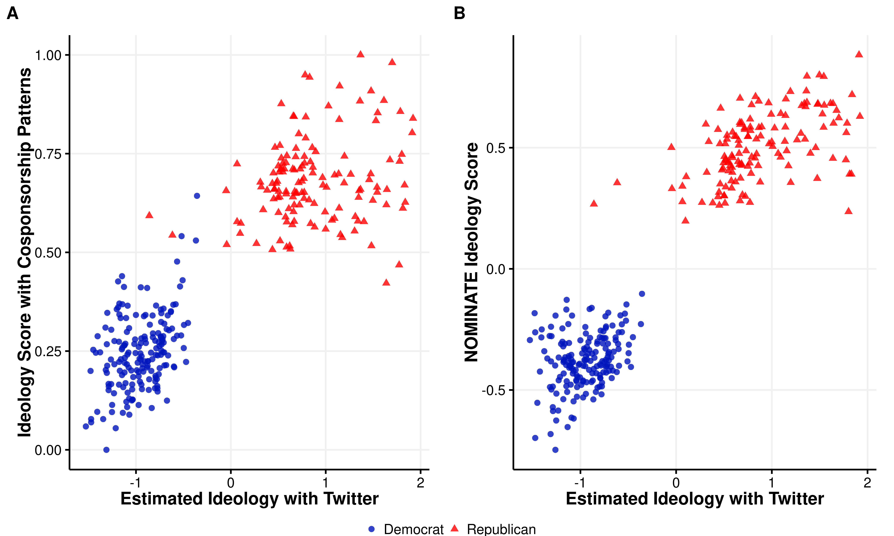
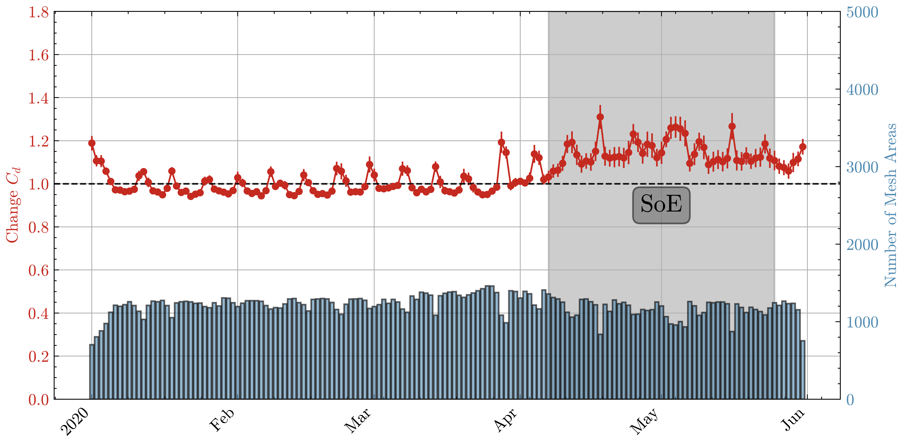
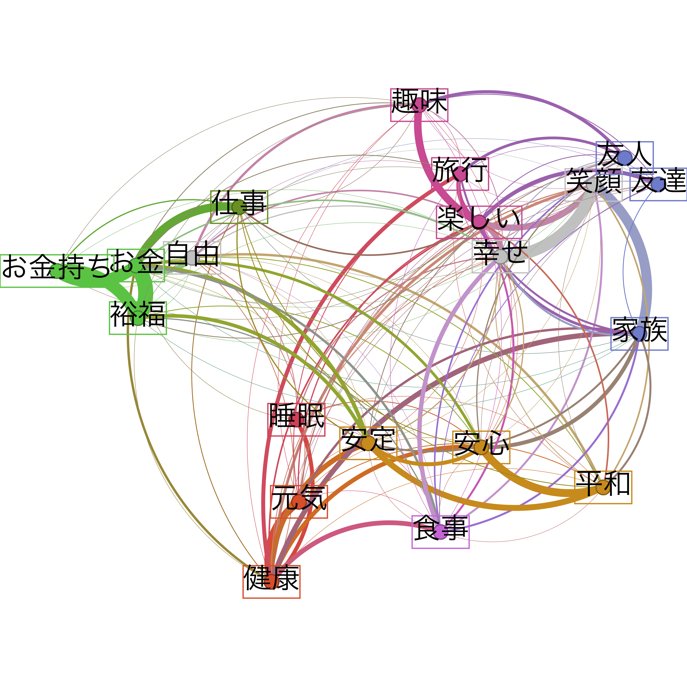
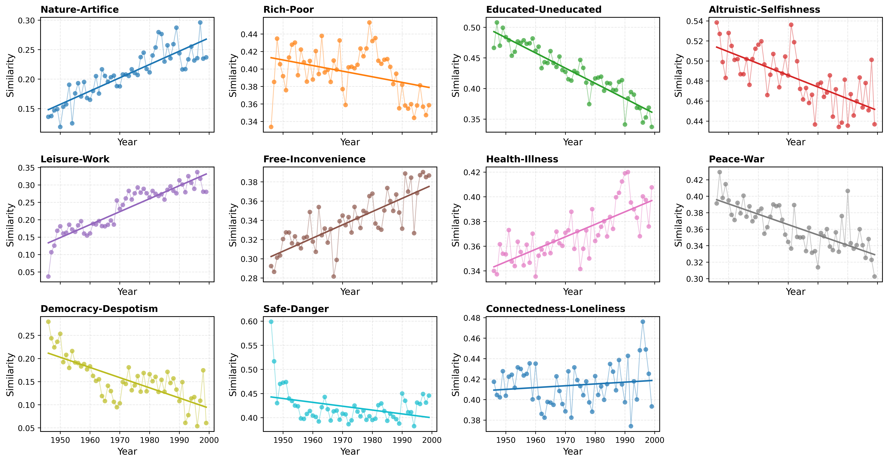
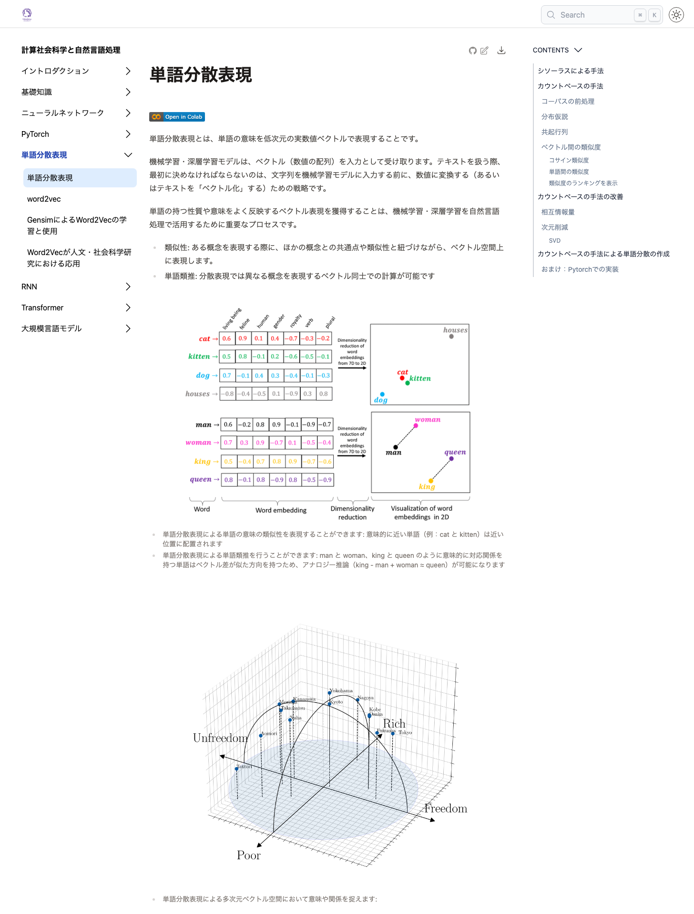
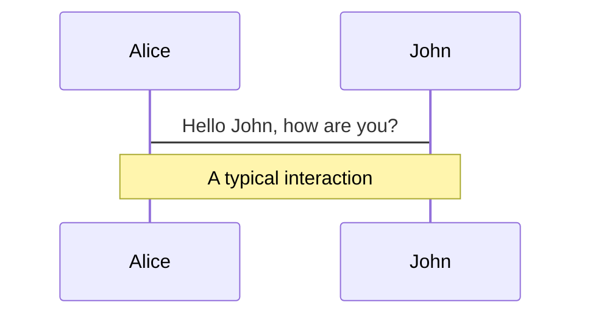
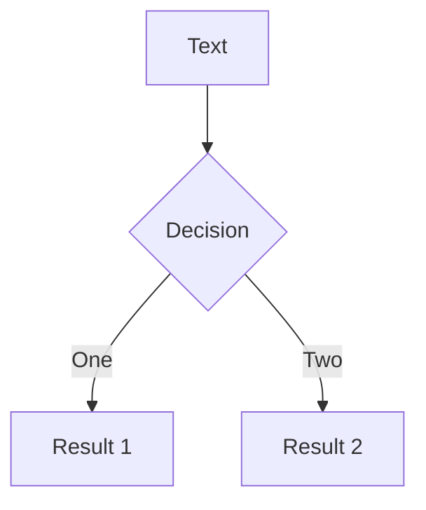
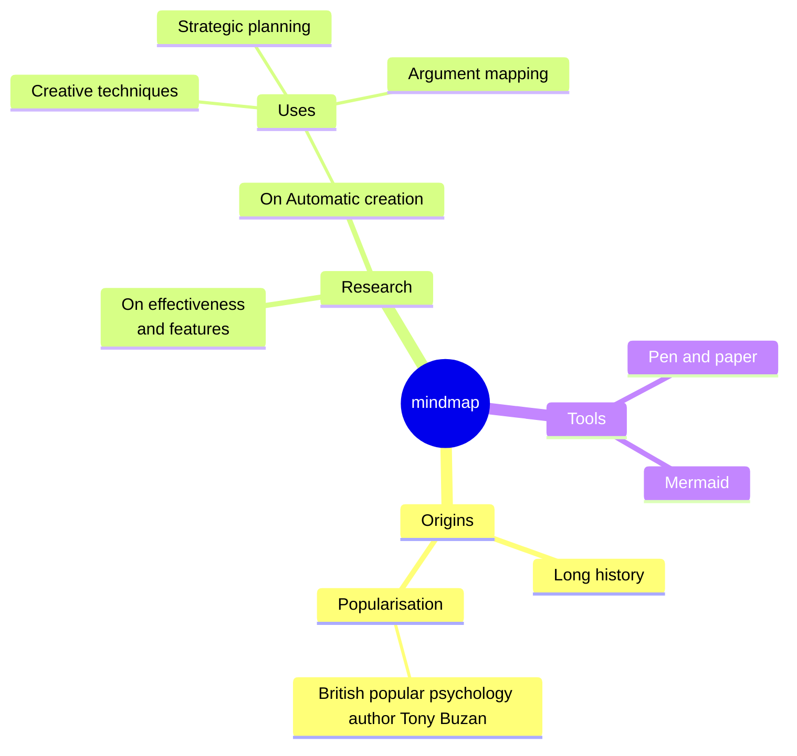
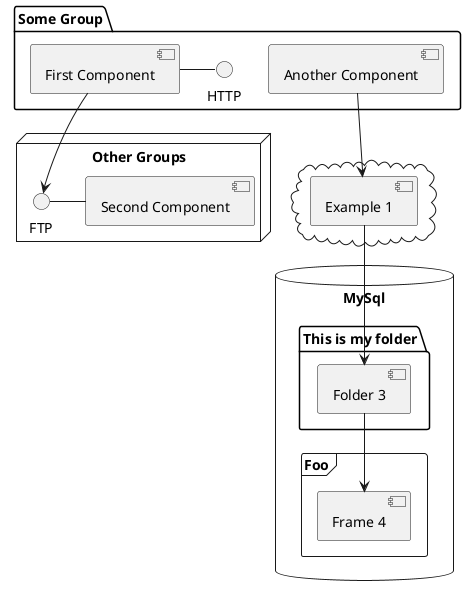

---
# try also 'default' to start simple
theme: neversink
# random image from a curated Unsplash collection by Anthony
# like them? see https://unsplash.com/collections/94734566/slidev
#background: https://cover.sli.dev
# some information about your slides (markdown enabled)
title: テニュア審査発表
drawings:
  persist: false
# slide transition: https://sli.dev/guide/animations.html#slide-transitions
transition: slide-left
# enable MDC Syntax: https://sli.dev/features/mdc
mdc: true
# duration of the presentation
duration: 20min
color: navy-light
layout: intro
colorSchema: light
---

# 総合人間学専攻社会人間学講座

## テニュア審査発表

### 呂 沢宇 / Zeyu Lyu <a href="https://researchmap.jp/lyuzeyu" class="ns-c-iconlink"><mdi-open-in-new /></a>  

2025年11月25日

<div class="abs-br m-6 text-xl">
  <a href="https://tohoku.elsevierpure.com/en/persons/zeyu-lyu/" target="_blank" class="slidev-icon-btn">
  <svg xmlns="http://www.w3.org/2000/svg" width="1.3em" height="1.3em" viewBox="0 0 24 24" fill="currentColor">
    <path d="m24 19.059l-.14-1.777c-1.426.772-2.945 1.076-4.465 1.076c-3.319 0-5.96-2.782-5.96-6.475c0-3.903 2.595-6.31 5.633-6.31c1.917 0 3.39.303 4.792 1.075L24 4.895c-1.286-.608-2.337-.889-4.698-.889c-4.534 0-7.97 3.53-7.97 8.017c0 5.12 4.09 7.924 7.9 7.924c1.916 0 3.506-.257 4.768-.888m-14.954-3.46c0-2.22-1.964-3.225-3.857-4.347C3.716 10.364 2.15 9.756 2.15 8.12c0-1.215.889-2.548 2.642-2.548c1.519 0 2.57.234 3.903 1.029l.117-1.847c-1.239-.514-2.127-.748-4.137-.748C1.8 4.006.047 5.876.047 8.26s2.103 3.413 4.02 4.581c1.426.865 2.922 1.45 2.922 2.992c0 1.496-1.333 2.571-2.922 2.571c-1.566 0-2.594-.35-3.786-1.075L0 19.176c1.215.56 2.454.818 4.16.818c2.385 0 4.885-1.473 4.885-4.395z"/>
  </svg>
</a>
  <a href="https://scholar.google.com/citations?user=W1k3wDIAAAAJ&hl=ja" target="_blank" class="slidev-icon-btn">
  <svg xmlns="http://www.w3.org/2000/svg" width="1.3em" height="1.3em" viewBox="0 0 512 512" fill="currentColor">
    <path d="M390.9 298.5s0 .1.1.1c9.2 19.4 14.4 41.1 14.4 64C405.3 445.1 338.5 512 256 512s-149.3-66.9-149.3-149.3c0-22.9 5.2-44.6 14.4-64c1.7-3.6 3.6-7.2 5.6-10.7q6.6-11.4 15-21.3c27.4-32.6 68.5-53.3 114.4-53.3c33.6 0 64.6 11.1 89.6 29.9c9.1 6.9 17.4 14.7 24.8 23.5c5.6 6.6 10.6 13.8 15 21.3c2 3.4 3.8 7 5.5 10.5zm26.4-18.8c-30.1-58.4-91-98.4-161.3-98.4s-131.2 40-161.3 98.4L0 202.7L256 0l256 202.7l-94.7 77.1z"/>
  </svg>
  </a>
</div>

<!--
The last comment block of each slide will be treated as slide notes. It will be visible and editable in Presenter Mode along with the slide. [Read more in the docs](https://sli.dev/guide/syntax.html#notes)
-->

---
layout: top-title
color: navy-light
---

:: title ::

# 発表の流れ

:: content ::

- **東北大学着任後の業績**
    - 研究実績：主要な研究内容 / 研究活動 / 論文・学会発表の状況
    - 教育実績：授業設計への工夫 / 学生指導の実績

- **今後の研究に対する抱負**
    - 今後の研究計画：競争的資金獲得を見据えた研究の発展と高度化
    - 研究業績に関する目標: 着実に国際的な論文成果へつながる研究推進

- **今後の教育に対する抱負**
    - 授業の改善に向けて工夫：最新研究動向を反映した授業内容の充実化
    - 研究室の運営: 研究グループとして活動する体制・環境の整備


---
layout: section
---

# `東北大学着任後の業績` 


東北大学着任後の研究実績と教育実績について紹介する

---
layout: side-title
side: l
color: violet
titlewidth: is-3
align: lt-lt

---

:: title ::

# デジタル空間における意見形成のメカニズムへの解明

- ビックデータ、自然言語処理とネットワーク分析など計算的手法を用いて、デジタル空間における意見ダイナミックとインタラクションの実態を把握する上で、その背後のメカニズムを体系的に解明する

<div style="text-align: right; font-size: 2em;">
  <mdi-arrow-right />
</div>

:: content ::

#### ソーシャルメディアにおける、異なるイデオロギーを持つ人々が政治的アイデンティティによって意見対立の激化 [(Lyu, 2023)](https://journals.sagepub.com/doi/10.1177/14614448231180654)

<div class='w-full bg-white border border-black flex flex-col h-42'>
  <h4 class="bg-violet-500 text-white px-6 py-2 m-0">フォローネットワークによるイデオロギーの推定</h4>
  <div class="flex items-center justify-center w-full p-4 pb-2 flex-1 gap-4">
    <div class="flex flex-col items-center flex-1">
      
    </div>
    <div class="flex flex-col items-center flex-1">
      
    </div>
  </div>
</div>

<div class="grid grid-cols-2 gap-4 mt-4">
  <div class='bg-white border border-black flex flex-col h-58'>
    <h4 class="bg-violet-500 text-white px-6 py-2 m-0">推定結果の検証</h4>
    <div class="flex items-center justify-center w-full p-4 pb-2 flex-1">
      
    </div>
  </div>

  <div class='bg-white border border-black flex flex-col h-58'>
    <h4 class="bg-violet-500 text-white px-6 py-2 m-0">意見対立の実態</h4>
    <div class="flex items-center justify-center w-full p-4 pb-2 flex-1">
      
    </div>
  </div>
</div>

<div class="mt-2 text-xs text-black text-opacity-60">
関連する論文: <a href="https://dl.acm.org/doi/10.1145/3358695.3360922" target="_blank" style="color: inherit; text-decoration: none;">Lyu (2019)</a>, <a href="https://doi.org/10.11218/ojjams.35.170" target="_blank" style="color: inherit; text-decoration: none;">Lyu (2020)</a>, <a href="https://doi.org/10.1016/j.heliyon.2022.e10419" target="_blank" style="color: inherit; text-decoration: none;">Lyu & Takikawa (2022)</a>, <a href="https://osf.io/preprints/socarxiv/9hvgf_v1" target="_blank" style="color: inherit; text-decoration: none;">Lyu,Takikawa & Shimokubo (2025)</a>.
</div>


---
layout: side-title
side: l
color: violet
titlewidth: is-3
align: lt-lt

---

:: title ::

# 移動データによる社会的空間隔離の解明

- 社会的空間隔離とは、異なる社会集団が地理的に分離される現象を指す

- 移動ビッグデータと地理空間情報の統合を通して社会的空間隔離の実態を明らかにし、それに基づいて社会的空間隔離の変化メカニズムについて、複数の都市と時点の比較分析を通じて理解する

<div style="text-align: right; font-size: 2em;">
  <mdi-arrow-right />
</div>

:: content ::


<div class='w-full bg-white border border-black flex flex-col h-55'>
  <h4 class="bg-violet-500 text-white px-6 py-2 m-0">
    移動データと地理空間情報による社会的空間隔離の推定
  </h4>
  <div class="flex items-start w-full p-4 pb-1 flex-1 gap-4">
    <div class="flex items-center justify-center flex-[2]">
      
    </div>
    <div class="flex-1 text-xs flex flex-col justify-center">
      <ul class="space-y-0.5">
        <li>2022年から研究協力者として参加しているJSTさきがけプロジェクト(代表:瀧川裕貴)を通じて、大規模移動データと地理空間情報データを管理環境と解析手法を確立した</li>
        <li>2025年採択の<a href="https://kaken.nii.ac.jp/ja/grant/KAKENHI-PROJECT-25K16783/" target="_blank" style="color: inherit; text-decoration: none;">若手研究</a>により、関連研究を推進中</li>
      </ul>
    </div>
  </div>
</div>

<div class="grid gap-4 mt-4" style="grid-template-columns: 2.5fr 3fr;">
  <div class='bg-white border border-black flex flex-col h-58'>
    <h4 class="bg-violet-500 text-white px-6 py-2 m-0">社会的空間隔離の実態</h4>
    <div class="flex items-center justify-center w-full p-4 pb-2 flex-1">
      
    </div>
  </div>

  <div class='bg-white border border-black flex flex-col h-58'>
    <h4 class="bg-violet-500 text-white px-6 py-2 m-0">社会的空間隔離の推移</h4>
    <div class="flex items-center justify-center w-full p-4 pb-2 flex-1">
      
    </div>
  </div>
</div>


<div class="mt-2 text-xs text-black text-opacity-60">
関連する論文: <a href="https://medinform.jmir.org/2022/3/e31557" target="_blank" style="color: inherit; text-decoration: none;">Lyu & Takikawa (2022)</a>
</div>

---
layout: top-title
color: violet
align: l
---


:: title ::

# その他の研究活動:積極的に多様な分野の研究者と共同研究の展開

:: content ::

<div class='w-full bg-white border border-black flex flex-col h-60'>
  <h4 class="bg-violet-500 text-white px-6 py-2 m-0">
    社会科学
  </h4>
  <div class="grid gap-4 p-4 flex-1" style="grid-template-columns: 4fr 2fr;">
    <div class="flex flex-col">
      <ul class="text-xs px-2 mb-0 space-y-0">
        <li>研究協力者としてムーンショット型研究開発事業(代表:瀧川裕貴)に参加し、計算社会科学⼿法による福祉・主体性の内実を解明する研究に取り組む (<a href="https://osf.io/preprints/socarxiv/g7n25_v1" target="_blank" style="color: inherit; text-decoration: none;">Lyu et al., 2025</a>)</li>
      </ul>
      <div class="grid gap-2" style="grid-template-columns: 2fr 4.5fr;">
        <div class="flex items-center justify-center">
          
        </div>
        <div class="flex items-center justify-center">
          
        </div>
      </div>
    </div>
    <div class="flex flex-col justify-start text-xs px-2 pt-0.2">
      <ul class="space-y-0">
        <li>「<a href="https://kaken.nii.ac.jp/ja/grant/KAKENHI-PROJECT-24K21436/" target="_blank" style="color: inherit; text-decoration: none;">ビッグデータを用いた社会秩序問題の解明−計算社会秩序論の創成−</a>」(挑戦的研究,代表:佐藤嘉倫)に参加し、ビックデータ解析とシミュレーションの実装を担当</li>
        <li>「SSM2025プロジェクト」ビックデータタスクフォースメンバー</li>
        <li>国際的データベース構築プロジェクト<a href="https://worldelitedatabase.org/" target="_blank" style="color: inherit; text-decoration: none;">World Elite Database</a>における日本側のグループメンバー</li>
      </ul>
    </div>
  </div>
</div>

<div class="grid grid-cols-2 gap-4 mt-4">
  <div class='bg-white border border-black flex flex-col h-50'>
    <h4 class="bg-violet-500 text-white px-6 py-2 m-0">
      歴史学・天文学
    </h4>
    <div class="flex items-center justify-center w-full p-4 flex-1 pt-0.2 text-sm">
      <ul class="space-y-0">
        <li>共同研究者:「歴史史料から探る100年以上の長期気象変化」(村田学術振興・教育財団研究助成,代表:市川幸平)
        </li>
        <li>歴史資料を用いて過去の天文現象と気候変化を解析 <a href="https://rmets.onlinelibrary.wiley.com/doi/10.1002/gdj3.227" target="_blank" style="color: inherit; text-decoration: none;"> (Lyu et al., 2023)</a>
        </li>
      </ul>
    </div>
  </div>

  <div class='bg-white border border-black flex flex-col h-50'>
    <h4 class="bg-violet-500 text-white px-6 py-2 m-0">
      情報科学
    </h4>
    <div class="flex items-center justify-center w-full p-4 flex-1 text-sm pt-0.2">
      <ul class="space-y-0">
        <li>大規模言語モデル駆動のエージェントに基づく社会シミュレーション:Chuan Xiao(大阪大学);Jinjun Xiong(University at Buffalo);
        </li>
        <li>大規模移動データ解析、移動情報と社会調査の統合: 澁谷遊野(東京大学); Yuan Liao (Chalmers University of Technology)
        </li>
      </ul>
    </div>
  </div>
</div>


---
layout: two-cols-title
columns: is-3
align: r-lt-lt
---

:: left ::

- 東北大学着任後、論文8本（査読付き5本）と、書籍分担2本を発表(掲載予定も含む)

- Scopus に登録された論文は4本、そのうち2本は分野別ランキング上位10％の雑誌に掲載


:: right ::

#### 東北大学着任後主要な論文発表　📝

- **Lyu, Z.**, & Cato, S. (2025). How Empathy and Partisanship Affected Attitude Changes Following the Assassination of Shinzo Abe: Evidence from Panel Surveys. *Public Opinion Quarterly*, Accepted ⭐

- Wang, Z., & **Lyu, Z.** (2025). The Impact of Regional Economic Conditions on Bidding Strategies in Online Labor Markets. In *Proceedings of IEEE International Conference on Big Data*. Accepted.


- **Lyu, Z.**, Ichikawa, K., Cheng, Y., Hayakawa, H., & Kawamoto, Y. (2023). Digitization of weather records of Seungjeongwon Ilgi: A historical weather dynamics dataset of the Korean Peninsula in 1623–1910. *Geoscience Data Journal*, *11*, 504–513. [https://doi.org/10.1002/gdj3.227](https://doi.org/10.1002/gdj3.227)

- **Lyu, Z.** (2023). Cross-cutting interaction, inter-party hostility, and partisan identity: Analysis of offensive speech in social media. *New Media and Society*, *27*(2), 595-613. [https://doi.org/10.1177/14614448231180654](https://doi.org/10.1177/14614448231180654) ⭐

<div class="text-xs text-gray-600 mt-2">
📝: 2025年11月時点で Scopus に登録されている雑誌・プロシーディングに掲載（または掲載予定）の論文を記載。掲載先のうち、分野別ランキングで上位10％に入る雑誌については、⭐マークで示す
</div>


---
layout: side-title
side: r
color: pink-light
titlewidth: is-4
align: lt-lm
---

:: title ::

# 授業への取り組む

- 授業資料をオンラインで公開し、学生が自主的に学習を進めるように工夫

- 実践的なスキルの習得を重視し、授業では実行可能なコード例や課題を組み込むことで、実践力の向上を図る
# <mdi-arrow-left />

:: content ::

<div class="text-sm">

## 担当した授業
　
- 「2025年度」 行動科学概論:社会科学におけるモデル入門 <a href="https://github.com/lvzeyu/social_modeling_lecture" class="ns-c-iconlink"><mdi-open-in-new /></a>  

- 「2024~2025年度」知識グラフ推論チャンレンジPBL(産業技術総合研究所との共同授業) <a href="https://github.com/lvzeyu/Tohoku_AIE_PBL" class="ns-c-iconlink"><mdi-open-in-new /></a>  

- 「2024年度」計算人文社会学研究演習Ⅲ：社会調査法への認知科学的アプローチ

- 「2023~2025年度」計算人文社会学研究演Ⅱ・行動科学演習：計算社会科学と自然言語処理 <a href="https://lvzeyu.github.io/css_nlp/intro.html" class="ns-c-iconlink"><mdi-open-in-new /></a>  

- 「2023~2025年度」計算人文社会学研究演Ⅰ・行動科学演習：計算社会科学のためのPythonプログラミング入門 <a href="https://lvzeyu.github.io/css_tohoku/intro.html" class="ns-c-iconlink"><mdi-open-in-new /></a>

<div class="grid grid-cols-3 gap-4 mt-4">
  <div class='bg-white flex flex-col h-50'>
    <div class="flex items-center justify-center w-full p-4 pb-2 flex-1">
      
    </div>
    <div class="text-xs text-center px-2 pb-2">
      いつでも・どこでもアクセス可能な授業資料
    </div>
  </div>

  <div class='bg-white flex flex-col h-50'>
    <div class="flex items-center justify-center w-full p-4 pb-2 flex-1">
      
    </div>
    <div class="text-xs text-center px-2 pb-2">
      実践的なスキル習得を目的に、コードの具体例を取り入れながら授業を進行
    </div>
  </div>

  <div class='bg-white flex flex-col h-50'>
    <div class="flex items-center justify-center w-full p-4 pb-2 flex-1">
      
    </div>
    <div class="text-xs text-center px-2 pb-2">
      実践的な問題解決力が求められる課題を通じて、授業内容の理解と応用力を強化
    </div>
  </div>
</div>

</div> 


---
layout: side-title
side: r
color: pink-light
titlewidth: is-4
align: lt-lm
---

:: title ::

# 学生指導への取り組む

- 定期的なゼミにて学生の研究進捗を確認し、ニーズに応じて個別相談にも対応。研究が順調に進むよう継続的にサポート

- 学生との共同研究の実施も積極的に検討し、研究経験・スキル・業績形成を後押し

# <mdi-arrow-left />

:: content ::


## 学部生への指導
　
- B3前期：教科書『計算社会科学入門』の輪読を通じて、分野全般の基礎知識と主要研究手法を習得
- B3後期：Python ワークショップを定期的に実施し、プログラミングの実践力と応用スキルを強化
- B4: 定期ゼミに加え、個別相談も行いながら、卒業論文の完成をサポート

## 院生への指導

- 国際学会発表や国際誌掲載を念頭に、ゼミを英語で実施
- 学生との共同研究を積極的に推進
    - すでに<a href="https://osf.io/preprints/socarxiv/5zrhq_v1" target="_blank" style="color: inherit; text-decoration: none;">Yamakuchi & Lyu (2025)</a>, <a href="https://www.jis.ac.cn/CN/Y2025/V4/I2/138" target="_blank" style="color: inherit; text-decoration: none;">Wang & Lyu (2025)</a>など掲載済み・投稿中の共同研究実績あり


---
layout: section
---

# `今後の研究に対する抱負` 

今後の研究計画と研究業績に関する目標を述べる


---
transition: slide-up
level: 2
---

# Navigation

Hover on the bottom-left corner to see the navigation's controls panel, [learn more](https://sli.dev/guide/ui#navigation-bar)

## Keyboard Shortcuts

|                                                     |                             |
| --------------------------------------------------- | --------------------------- |
| <kbd>right</kbd> / <kbd>space</kbd>                 | next animation or slide     |
| <kbd>left</kbd>  / <kbd>shift</kbd><kbd>space</kbd> | previous animation or slide |
| <kbd>up</kbd>                                       | previous slide              |
| <kbd>down</kbd>                                     | next slide                  |

<!-- https://sli.dev/guide/animations.html#click-animation -->

<p v-after class="absolute bottom-23 left-45 opacity-30 transform -rotate-10">Here!</p>

---
layout: two-cols
layoutClass: gap-16
---

# Table of contents

You can use the `Toc` component to generate a table of contents for your slides:

```html
<Toc minDepth="1" maxDepth="1" />
```

The title will be inferred from your slide content, or you can override it with `title` and `level` in your frontmatter.

::right::

<Toc text-sm minDepth="1" maxDepth="2" />

---
layout: image-right
image: https://cover.sli.dev
---

# Code

Use code snippets and get the highlighting directly, and even types hover!

```ts [filename-example.ts] {all|4|6|6-7|9|all} twoslash
// TwoSlash enables TypeScript hover information
// and errors in markdown code blocks
// More at https://shiki.style/packages/twoslash
import { computed, ref } from 'vue'

const count = ref(0)
const doubled = computed(() => count.value * 2)

doubled.value = 2
```

<arrow v-click="[4, 5]" x1="350" y1="310" x2="195" y2="342" color="#953" width="2" arrowSize="1" />

<!-- This allow you to embed external code blocks -->
<<< @/snippets/external.ts#snippet

<!-- Footer -->

[Learn more](https://sli.dev/features/line-highlighting)

<!-- Inline style -->
<style>
.footnotes-sep {
  @apply mt-5 opacity-10;
}
.footnotes {
  @apply text-sm opacity-75;
}
.footnote-backref {
  display: none;
}
</style>

<!--
Notes can also sync with clicks

[click] This will be highlighted after the first click

[click] Highlighted with `count = ref(0)`

[click:3] Last click (skip two clicks)
-->

---
level: 2
---

# Shiki Magic Move

Powered by [shiki-magic-move](https://shiki-magic-move.netlify.app/), Slidev supports animations across multiple code snippets.

Add multiple code blocks and wrap them with <code>````md magic-move</code> (four backticks) to enable the magic move. For example:

````md magic-move {lines: true}
```ts {*|2|*}
// step 1
const author = reactive({
  name: 'John Doe',
  books: [
    'Vue 2 - Advanced Guide',
    'Vue 3 - Basic Guide',
    'Vue 4 - The Mystery'
  ]
})
```

```ts {*|1-2|3-4|3-4,8}
// step 2
export default {
  data() {
    return {
      author: {
        name: 'John Doe',
        books: [
          'Vue 2 - Advanced Guide',
          'Vue 3 - Basic Guide',
          'Vue 4 - The Mystery'
        ]
      }
    }
  }
}
```

```ts
// step 3
export default {
  data: () => ({
    author: {
      name: 'John Doe',
      books: [
        'Vue 2 - Advanced Guide',
        'Vue 3 - Basic Guide',
        'Vue 4 - The Mystery'
      ]
    }
  })
}
```

Non-code blocks are ignored.

```vue
<!-- step 4 -->
<script setup>
const author = {
  name: 'John Doe',
  books: [
    'Vue 2 - Advanced Guide',
    'Vue 3 - Basic Guide',
    'Vue 4 - The Mystery'
  ]
}
</script>
```
````

---

# Components

<div grid="~ cols-2 gap-4">
<div>

You can use Vue components directly inside your slides.

We have provided a few built-in components like `<Tweet/>` and `<Youtube/>` that you can use directly. And adding your custom components is also super easy.

```html
<Counter :count="10" />
```

<!-- ./components/Counter.vue -->
<Counter :count="10" m="t-4" />

Check out [the guides](https://sli.dev/builtin/components.html) for more.

</div>
<div>

```html
<Tweet id="1390115482657726468" />
```

<Tweet id="1390115482657726468" scale="0.65" />

</div>
</div>

<!--
Presenter note with **bold**, *italic*, and ~~striked~~ text.

Also, HTML elements are valid:
<div class="flex w-full">
  <span style="flex-grow: 1;">Left content</span>
  <span>Right content</span>
</div>
-->

---
class: px-20
---

# Themes

Slidev comes with powerful theming support. Themes can provide styles, layouts, components, or even configurations for tools. Switching between themes by just **one edit** in your frontmatter:

<div grid="~ cols-2 gap-2" m="t-2">

```yaml
---
theme: default
---
```

```yaml
---
theme: seriph
---
```


</div>

Read more about [How to use a theme](https://sli.dev/guide/theme-addon#use-theme) and
check out the [Awesome Themes Gallery](https://sli.dev/resources/theme-gallery).

---

# Clicks Animations

You can add `v-click` to elements to add a click animation.

<div v-click>

This shows up when you click the slide:

```html
<div v-click>This shows up when you click the slide.</div>
```

</div>

<br>

<v-click>

The <span v-mark.red="3"><code>v-mark</code> directive</span>
also allows you to add
<span v-mark.circle.orange="4">inline marks</span>
, powered by [Rough Notation](https://roughnotation.com/):

```html
<span v-mark.underline.orange>inline markers</span>
```

</v-click>

<div mt-20 v-click>

[Learn more](https://sli.dev/guide/animations#click-animation)

</div>

---

# Motions

Motion animations are powered by [@vueuse/motion](https://motion.vueuse.org/), triggered by `v-motion` directive.

```html
<div
  v-motion
  :initial="{ x: -80 }"
  :enter="{ x: 0 }"
  :click-3="{ x: 80 }"
  :leave="{ x: 1000 }"
>
  Slidev
</div>
```

<div class="w-60 relative">
  <div class="relative w-40 h-40">
    
    
    
  </div>

  <div
    class="text-5xl absolute top-14 left-40 text-[#2B90B6] -z-1"
    v-motion
    :initial="{ x: -80, opacity: 0}"
    :enter="{ x: 0, opacity: 1, transition: { delay: 2000, duration: 1000 } }">
    Slidev
  </div>
</div>

<!-- vue script setup scripts can be directly used in markdown, and will only affects current page -->
<script setup lang="ts">
const final = {
  x: 0,
  y: 0,
  rotate: 0,
  scale: 1,
  transition: {
    type: 'spring',
    damping: 10,
    stiffness: 20,
    mass: 2
  }
}
</script>

<div
  v-motion
  :initial="{ x:35, y: 30, opacity: 0}"
  :enter="{ y: 0, opacity: 1, transition: { delay: 3500 } }">

[Learn more](https://sli.dev/guide/animations.html#motion)

</div>

---

# $\LaTeX$

$\LaTeX$ is supported out-of-box. Powered by [$\KaTeX$](https://katex.org/).

<div h-3 />

Inline $\sqrt{3x-1}+(1+x)^2$

Block
$$ {1|3|all}
\begin{aligned}
\nabla \cdot \vec{E} &= \frac{\rho}{\varepsilon_0} \\
\nabla \cdot \vec{B} &= 0 \\
\nabla \times \vec{E} &= -\frac{\partial\vec{B}}{\partial t} \\
\nabla \times \vec{B} &= \mu_0\vec{J} + \mu_0\varepsilon_0\frac{\partial\vec{E}}{\partial t}
\end{aligned}
$$

[Learn more](https://sli.dev/features/latex)

---

# Diagrams

You can create diagrams / graphs from textual descriptions, directly in your Markdown.

<div class="grid grid-cols-4 gap-5 pt-4 -mb-6">









</div>

Learn more: [Mermaid Diagrams](https://sli.dev/features/mermaid) and [PlantUML Diagrams](https://sli.dev/features/plantuml)

---
foo: bar
dragPos:
  square: 691,32,167,_,-16
---

# Draggable Elements

Double-click on the draggable elements to edit their positions.

<br>

###### Directive Usage

```md

```

<br>

###### Component Usage

```md
<v-drag text-3xl>
  <div class="i-carbon:arrow-up" />
  Use the `v-drag` component to have a draggable container!
</v-drag>
```

<v-drag pos="663,206,261,_,-15">
  <div text-center text-3xl border border-main rounded>
    Double-click me!
  </div>
</v-drag>


###### Draggable Arrow

```md
<v-drag-arrow two-way />
```

<v-drag-arrow pos="67,452,253,46" two-way op70 />

---
src: ./pages/imported-slides.md
hide: false
---

---

# Monaco Editor

Slidev provides built-in Monaco Editor support.

Add `{monaco}` to the code block to turn it into an editor:

```ts {monaco}
import { ref } from 'vue'
import { emptyArray } from './external'

const arr = ref(emptyArray(10))
```

Use `{monaco-run}` to create an editor that can execute the code directly in the slide:

```ts {monaco-run}
import { version } from 'vue'
import { emptyArray, sayHello } from './external'

sayHello()
console.log(`vue ${version}`)
console.log(emptyArray<number>(10).reduce(fib => [...fib, fib.at(-1)! + fib.at(-2)!], [1, 1]))
```

---
layout: center
class: text-center
---

# Learn More

[Documentation](https://sli.dev) · [GitHub](https://github.com/slidevjs/slidev) · [Showcases](https://sli.dev/resources/showcases)

<PoweredBySlidev mt-10 />
